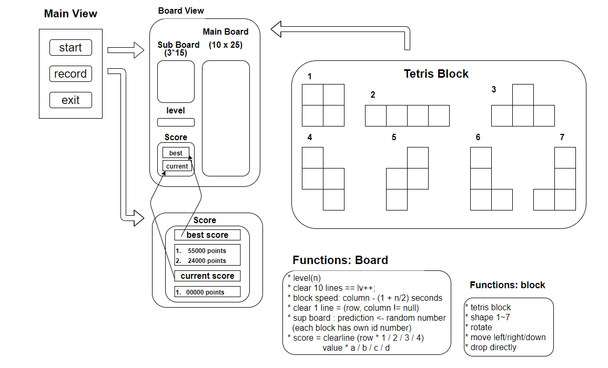

# 테트리스 (Tetris)
---
## [Java.Swing] 

- 요약 : 자바 스윙을 활용한 테트리스 프로그램 구현

- Code Source : https://github.com/bkk91/tetris

- 언어 : Java

- 통합 개발 환경(IDE) : Eclipse (ver. 2021.03)

- 내용 : 콘솔 프로젝트 이후, 스윙을 활용하여 구현해보고 싶다는 생각에 테트리스 구현

---

 <b> 1. 화면설계 (UI Design) </b> 

 

 <b> 2. 코드구현 </b> 

 

 

 <b> 3. 평가 (Evaluation) </b> 

 

 

---
